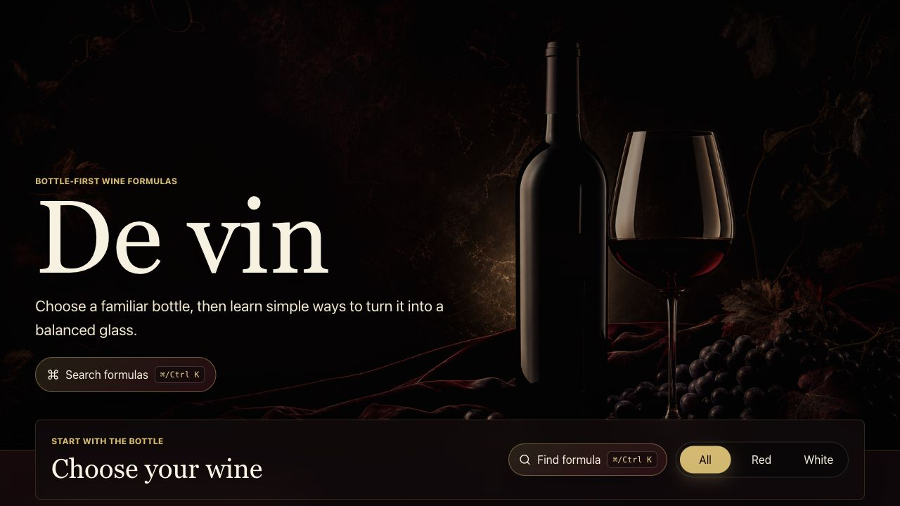

# De vin Wine Formula Website

De vin is a beginner-friendly, bottle-first wine formula catalog. Choose a familiar wine style, then explore simple drink formulas that can be mixed with that bottle.



## Features

- Cinematic black, deep red, ivory, and soft-gold visual direction
- Six starter wine categories: Pinot Noir, Merlot, Cabernet Sauvignon, Chardonnay, Sauvignon Blanc, and Riesling
- Curated local recipe data with ingredients, measurements, steps, taste notes, difficulty, and glassware
- Bottle-first catalog with red/white filtering
- JolyUI-inspired command palette for searching wines, recipes, ingredients, taste notes, and glassware
- Keyboard shortcut support with `Cmd/Ctrl + K`
- Responsive desktop and mobile layout
- Responsible drinking footer guidance

## Tech Stack

- React
- Vite
- Vitest
- React Testing Library
- CSS
- Lucide React icons

## Getting Started

Install dependencies:

```bash
npm install
```

Run the local development server:

```bash
npm run dev
```

Open the app:

```text
http://localhost:5173/
```

## Verification

Run tests:

```bash
npm test
```

Build for production:

```bash
npm run build
```

## Notes

This version uses curated local data instead of an external API. The site is designed for learning wine formulas, not shopping for bottles.
